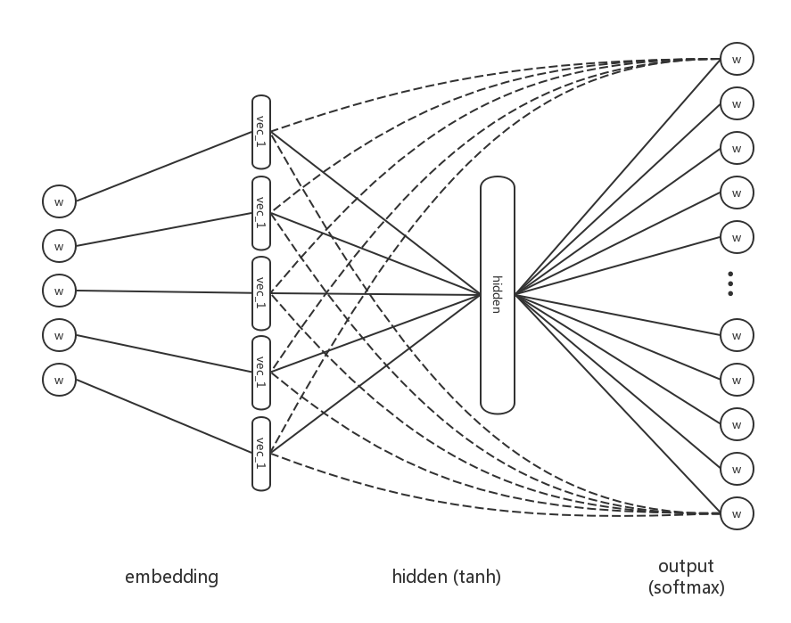

neural probabilistic language model from paper [link](http://www.jmlr.org/papers/volume3/bengio03a/bengio03a.pdf)


----
[reference]

A Neural Probabilistic Language Model


```python
from keras.models import Model
from keras.layers import Input, Dense, Embedding, Reshape, Add, Activation
```


```python
vocab_size = 17964
embedding_dim = 100
n = 6
h = 60
sequence = Input((n,), name='sequence')
embedded = Embedding(vocab_size, embedding_dim, name='embedding')(sequence)
embedded = Reshape((n * embedding_dim,))(embedded)
hidden = Dense(h, activation='tanh', name='hidden')(embedded)
pre_output_1 = Dense(vocab_size, activation='linear', name='pre_output_1')(hidden)
pre_output_2 = Dense(vocab_size, activation='linear', name='pre_output_2')(embedded)
pre_output_sum = Add()([pre_output_1, pre_output_2])
output = Activation('softmax')(pre_output_sum)

model = Model(inputs=[sequence], outputs=[output])
model.summary()
```

    ____________________________________________________________________________________________________
    Layer (type)                     Output Shape          Param #     Connected to                     
    ====================================================================================================
    sequence (InputLayer)            (None, 6)             0                                            
    ____________________________________________________________________________________________________
    embedding (Embedding)            (None, 6, 100)        1796400     sequence[0][0]                   
    ____________________________________________________________________________________________________
    reshape_5 (Reshape)              (None, 600)           0           embedding[0][0]                  
    ____________________________________________________________________________________________________
    hidden (Dense)                   (None, 60)            36060       reshape_5[0][0]                  
    ____________________________________________________________________________________________________
    pre_output_1 (Dense)             (None, 17964)         1095804     hidden[0][0]                     
    ____________________________________________________________________________________________________
    pre_output_2 (Dense)             (None, 17964)         10796364    reshape_5[0][0]                  
    ____________________________________________________________________________________________________
    add_4 (Add)                      (None, 17964)         0           pre_output_1[0][0]               
                                                                       pre_output_2[0][0]               
    ____________________________________________________________________________________________________
    activation_4 (Activation)        (None, 17964)         0           add_4[0][0]                      
    ====================================================================================================
    Total params: 13,724,628
    Trainable params: 13,724,628
    Non-trainable params: 0
    ____________________________________________________________________________________________________


```python
%notebook Untitled.ipynb
```


```python

```
